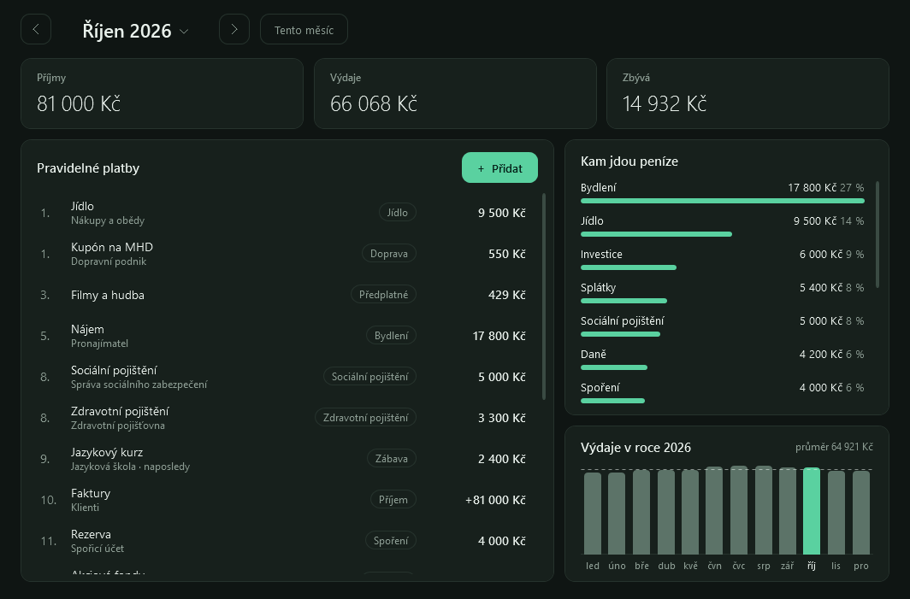
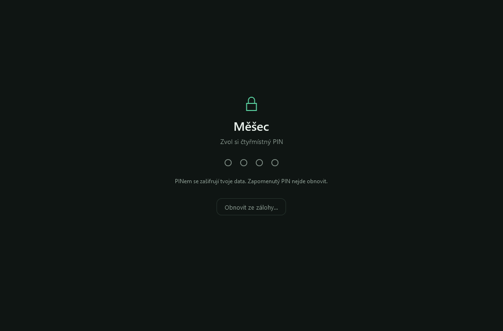

<p align="center">
  
</p>

<h1 align="center">Měšec</h1>

<p align="center">
  Měsíční rozpočet pod PINem. Výdaje, splatnosti a grafy, všechno jen u tebe na disku a zašifrované.
</p>

<p align="center">
  
</p>

- **Nic se neinstaluje ani nekompiluje.** Dva skripty v PowerShellu a jedno okno v XAML. Všechno, co
  potřebuje, už ve Windows je.
- **PIN jako ve Windows.** Při prvním spuštění si zvolíš čtyři číslice, příště je jen napíšeš. Enter není
  potřeba a na české klávesnici ani Shift.
- **Platby se vším všudy:** název, částka, den splatnosti, kam to jde a typ (bydlení, energie, zdravotní
  a sociální pojištění, daně, penzijko, investice, spoření, splátky, předplatné…). Opakované každý měsíc,
  nebo jednorázové.
- **Přehled měsíce:** příjmy, výdaje, kolik zbývá a kolik je ještě potřeba zaplatit. Rozpis je seřazený
  podle splatnosti, zaplacené si odškrtáváš a co je po splatnosti, zčervená.
- **Grafy:** kam jdou peníze podle typu a výdaje po měsících celého roku, včetně těch, které teprve přijdou.
- **Data nikam neodcházejí.** Jeden zašifrovaný soubor ve tvém profilu Windows, žádný server, žádný účet.

## Instalace

1. Stáhni **[Mesec.zip](https://github.com/JohnyLeeJohnes/mesec/releases/latest/download/Mesec.zip)**.
   Odkaz vede vždycky na nejnovější vydání.
2. Klikni na stažený ZIP pravým tlačítkem, zvol **Vlastnosti**, dole zaškrtni **Odblokovat** a potvrď.
3. Rozbal ho tam, kde má Měšec zůstat, třeba do Dokumentů.
4. Ve složce `Mesec` poklepej na **`install.cmd`**. Vytvoří zástupce **Měšec** s ikonou v nabídce Start,
   na ploše a přímo ve složce. Přes něj se aplikace spouští jako každá jiná, bez okna konzole.

> **Proč odblokovat?** Windows si soubory stažené z internetu označí a skripty s tímhle označením nemusí
> spustit. Když ZIP odblokuješ ještě před rozbalením, označení se na rozbalené soubory nepřenese.
> `install.cmd` ho ze souborů sundá i sám, jenže k tomu ho Windows nejdřív musí nechat spustit.

- **Jen vyzkoušet:** poklepej na `Mesec.cmd`, spustí Měšec bez vytváření zástupců.
- **Ukázka bez PINu a bez ukládání:** `powershell -ExecutionPolicy Bypass -File Mesec.ps1 -Demo`
- **S Bránocestou:** Měšec umí nainstalovat a spouštět i [Bránocesta](https://github.com/JohnyLeeJohnes/branocesta).
  Když ho pustíš z ní, má vpravo nahoře a na obrazovce s PINem tlačítko **Bránocesta**, které ho zavře
  a bránu vrátí. S Bránocestou od verze 1.5.0 je zpátky hned, protože za Měšcem čeká schovaná.
- **Nová verze:** stáhni ji stejně a rozbal přes tu starou. Data zůstanou, jsou uložená jinde.
- **Přesunutí složky:** zástupce ukazuje tam, kde Měšec leží. Po přesunutí spusť `install.cmd` znovu.
- **Odebrání:** smaž zástupce, složku s aplikací a data v `%APPDATA%\Mesec`.
- **Z gitu:** `git clone https://github.com/JohnyLeeJohnes/mesec.git` a pak rovnou krok 4. Klonování
  označení z internetu nepřidává, takže odblokování odpadá.

Potřebuješ Windows 10 (1803 a novější) nebo 11; Windows PowerShell 5.1 je jejich součástí. Vyzkoušeno
na Windows 11.

## Jak se s tím pracuje

<p align="center">
  
</p>

1. Při prvním spuštění napiš čtyřmístný PIN a pak ještě jednou pro kontrolu.
2. **+ Přidat** založí platbu. Příjem je položka s typem **Příjem**.
3. Kolečkem vlevo platbu odškrtneš jako zaplacenou, kliknutím na řádek ji upravíš nebo smažeš.
4. Šipkami nahoře (nebo kliknutím na sloupec v grafu) přecházíš mezi měsíci.

Opakovaná platba se sama objeví v každém dalším měsíci. Když ji změníš nebo smažeš, platí to **od
zobrazeného měsíce dál**; starší měsíce zůstanou, jak byly, takže zdražení nájmu nepřepíše historii.

## Kde jsou data a jak jsou chráněná

Data jsou v jediném souboru **`%APPDATA%\Mesec\data.bin`**, tedy mimo složku s aplikací. Do repozitáře
se nedostanou ani omylem; `.gitignore` navíc pro jistotu odmítá `*.bin` i zálohy `*.mesec`.

- **Šifrování PINem:** AES-256 s kontrolním součtem HMAC-SHA256. Klíč se z PINu odvozuje přes PBKDF2
  (200 000 kol). PIN se nikam neukládá; že je správný, se pozná jen podle toho, že data jdou otevřít.
- **Navíc DPAPI.** Čtyřmístný PIN má jen 10 000 možností a sám o sobě by šel uhodnout hrubou silou za pár
  sekund. Soubor je proto ještě zabalený do ochrany Windows, která ho váže na tvůj účet. Zkopírovaný
  jinam (cloud, flashka, jiný uživatel téhož počítače) je bez přihlášení k tvému účtu k ničemu, i kdyby
  někdo PIN znal.
- **Co z toho plyne:** PIN chrání před zvědavcem u tvého odemčeného počítače, ne před někým, kdo má na
  tvůj přihlášený účet čas a nástroje. Když odcházíš, zamykej Windows (`Win + L`).
- **Záloha:** tlačítko **Záloha** uloží soubor `.mesec`. Ten DPAPI záměrně nemá, aby šel otevřít i po
  přeinstalaci Windows nebo na jiném počítači. Chrání ho tedy jen PIN: nenechávej ho v cloudu ani na
  sdíleném disku.
- **Obnova:** na novém počítači spusť Měšec a na úvodní obrazovce zvol **Obnovit ze zálohy…**, pak zadej
  PIN, který platil při zálohování.
- **Přeinstalace Windows bez zálohy = konec dat.** Soubor `data.bin` z jiného účtu Windows otevřít nejde.
- **Zapomenutý PIN nejde obnovit.** Začít znovu jde jen smazáním složky `%APPDATA%\Mesec`.

## Úpravy

| Soubor | Obsah |
| --- | --- |
| `Mesec.ps1` | Okno: zámek s PINem, přehled měsíce, formulář položky, vytvoření zástupců. |
| `Mesec.xaml` | Vzhled okna: barvy, styly, rozložení. |
| `Data.ps1` | Šifrování souboru a počítání nad rozpočtem. O okně nic neví. |
| `Mesec.cmd`, `install.cmd` | Spuštění bez instalace a vytvoření zástupců. |
| `tools/make-icon.ps1` | Vygeneruje ikonu do `assets/`. |
| `tools/make-release.ps1` | Sestaví `dist/Mesec.zip` pro stránku Releases. |
| `tests/test.ps1` | Zkouška šifrování, měsíců a průchod oknem. |

Jiné typy plateb? Seznam `$categories` na začátku `Data.ps1`. Jiné barvy? Paleta na začátku `Mesec.xaml`.
Změny se projeví při dalším spuštění, nic se nesestavuje. Co se ve které verzi změnilo, je
v [CHANGELOG.md](CHANGELOG.md).

Test se pouští takhle:

```
powershell -ExecutionPolicy Bypass -File tests/test.ps1
```

Na chvíli otevře okno a samo ho projde. Data má v dočasné složce, tvých skutečných se nedotkne.

Obrázky v `docs/` jsou z ukázkových dat:

```
powershell -ExecutionPolicy Bypass -File Mesec.ps1 -Demo -Screenshot docs\prehled.png
```

---

**In English:** Měšec ("the purse") is a small monthly budget tracker for Windows 10/11. You enter your
recurring and one-off payments (amount, due day, recipient, category), tick them off as paid and see where
the money goes. It unlocks with a four-digit PIN; the data file is AES-256 encrypted with a key derived from
the PIN, wrapped in Windows DPAPI, and never leaves your machine. It is a PowerShell script with a WPF
window: download [Mesec.zip](https://github.com/JohnyLeeJohnes/mesec/releases/latest/download/Mesec.zip),
unblock and extract it, and run `install.cmd` to get a shortcut. Nothing to compile or install. The interface
is in Czech.
